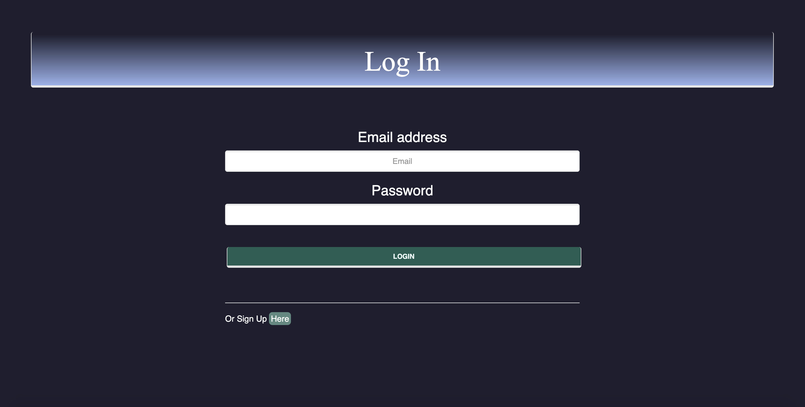

# StockME
[Stock ME Deploy Application!](http://polar-dawn-54577.herokuapp.com/login.html) - http://polar-dawn-54577.herokuapp.com/login.html

* This is a stock-related app which can help user keep their investments in record, and also let manager and master control users account which we call it member account. 

* The user could sign on a member account. The functionalities of this member account are:

1. The users could add, delete a stock with its symbol. 

2. They could get stock informations like previous closed price, open price, change percentage and so on.

3. they can Input purchased amount to selected stock then it will automatically calculate the profit and loss on a daily basis.  and with multiple purchases, we will calculate the total amount they purchased in this app. 

4. the users could upload notes to each individual stock.


* We also created two other administrative level accounts - manager account and master account.
* For manager account we can do the following things:
1. to pull out all member’s account and its account details. 
2. Manager can delete any member account.
3. Manager can add administrative notes to each individual member account. 

* For the master account. The main functionality of master account is to upgrade member account to manager account or degrade manager account to member account. Which means the master account is highest level account and we only create master account by using the back-end database. 

